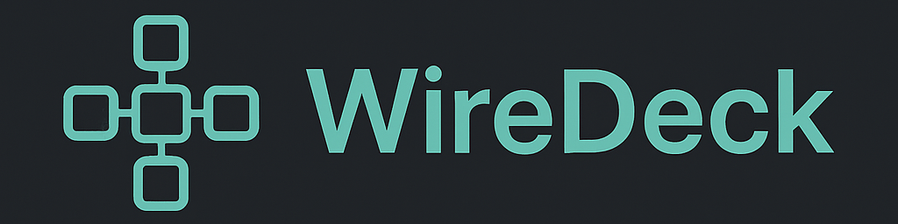

<p align="center">

</p>
<p align="center">


</p>

## 🌐 WireDeck

**WireDeck** is a containerized platform for managing multiple **WireGuard VPN servers** using a clean, intuitive **Web UI**.

It leverages:

- **Node.js + Express** for the core manager service
- **Dockerode** for interacting with Docker
- **NGINX** for SSL and Proxy
- **Certbot** for automatic HTTPS certificate issuance and renewal

The platform makes deploying and managing multiple [wg-easy](https://github.com/wg-easy/wg-easy) (v15.1) instances secure, scalable, and centralized.


## 📦 Deploy
> [!NOTE]
> The project require **docker** and **docker compose** on host to containerize the entire solution, allowing for easy setup and scalability.

#### 0. Clone the repo
```
git clone https://github.com/SzomorXVigyor/WireDeck.git
```

#### 1. Configuration
Create .env configuration from .env.example

```sh
# Domain of the application
ROOT_DOMAIN=example.com

# Default username and password for the admin user of manager and wireguard instances
INIT_USERNAME=admin
INIT_PASSWORD=your-password

# email address for receiving certbot notifications
CERTBOT_EMAIL=email@example.com

# JWT secret for securing application
JWT_SECRET=your-jwt-secret
```

#### 2. Create docker network

```sh
docker network create --driver bridge --subnet=172.20.0.0/23 wgnet
```

#### 3. Create work directories

```sh
mkdir -p database nginx/sites
```

#### 4. DNS Configuration

* Set A record for root domain points to server IP
* Set wildcard DNS (*.example.com) for subdomains

#### 5. Obtain root certificate
It will automaticly renew by cert manager module.

```sh
docker run --rm -v /etc/letsencrypt:/etc/letsencrypt -v /var/www/certbot:/var/www/certbot -p 80:80 certbot/certbot certonly --standalone --email your-email@domain.com --agree-tos --no-eff-email -d your-domain.com
```

#### 6. Start the app

```sh
docker compose --env-file .env up -d
```

## 📜 License

This project is licensed under the **MIT License**. See [LICENSE](./LICENSE) for details.